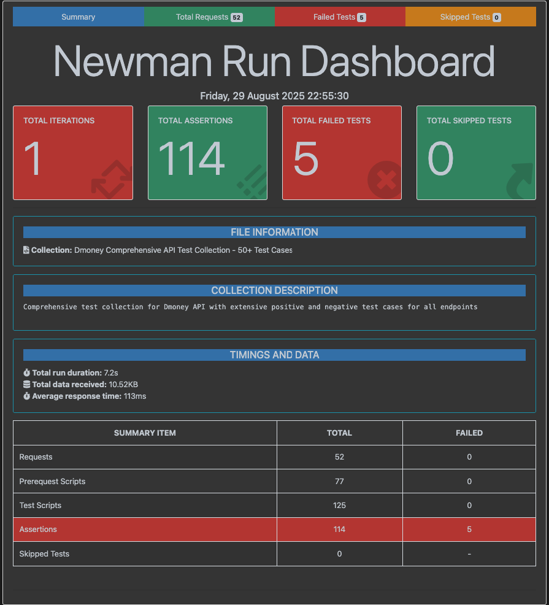

# 💰 DMoney Transaction Flow Integration

<div align="center">


**A comprehensive fintech system for seamless money transactions**

[](https://nodejs.org/)
[](https://www.npmjs.com/package/newman)
[](https://www.postman.com/)
[](LICENSE)

</div>

## 🌟 Overview

DMoney is a demo fintech system that enables seamless money transactions between different user roles. The system supports multiple user types including agents, customers, merchants, and administrators, each with specific capabilities for money exchange and user management.

## ✨ Features

- 👥 **Multi-Role Support**: Create and manage agents, customers, merchants, and admin users
- 💸 **Money Transactions**: Secure money exchange between different user roles


## 🛠️ Technology Stack

- **Runtime**: Node.js
- **API Testing**: Postman Collections
- **Test Runner**: Newman
- **Reporting**: HTML Extra Reporter
- **Environment Management**: dotenv

## 🚀 Quick Start

### Prerequisites

- Node.js (v18 or higher)
- npm or yarn package manager

### Installation

1. **Clone the repository**
   ```bash
   git clone https://github.com/Jannatul206/Domoney_JFR-34185-batch-16.git
   Domoney_JFR-34185-batch-16
   ```

2. **Install dependencies**
   ```bash
   npm install
   ```

3. **Environment Setup**
   ```bash
   # Copy the environment template
   cp env.template .env
   
   # Edit .env file and add your PMAT key
   # PMAT_KEY=your_postman_api_key_here
   ```

4. **Run the tests**
   ```bash
   npm start
   ```

## 📋 Available Scripts

| Command | Description |
|---------|-------------|
| `npm start` | Run the complete test suite |
| `npm test` | Run tests (alias for start) |
| `npm run dev` | Run in development mode |

## 📊 Test Reports

After running the tests, you'll find a detailed HTML report in the `Reports/` directory:
- **Location**: `./Reports/report.html`
- **Content**: Comprehensive test results with request/response details
- **Format**: Interactive HTML with charts and metrics

## 📁 Project Structure

```
dmoney-newman-b16/
├── collection/
│   ├── demoney1.json           # Postman collection
│   ├── newman_demoney.png      # Project logo
│   └── JFR-34185-batch16.postman_test_run.json
├── Reports/
│   └── report.html             # Generated test report
├── report.js                   # Newman test runner
├── package.json               # Project dependencies
├── env.template               # Environment template
└── README.md                  # Project documentation
```

## 🔗 Documentation & Resources

| Resource | Link |
|----------|------|
| 📚 **API Documentation** | [Postman Docs](https://documenter.getpostman.com/view/46796575/2sB3HhrMSK) |
| 📋 **Test Case Report** | [Google Sheets](https://docs.google.com/spreadsheets/d/1YXAmZ2Tm1Q_0T5Vg5fEauw2WuH4gwMwt5pt6WPeo2AQ/edit?usp=sharing) |
| 🐛 **Bug Report** | [Google Sheets](https://docs.google.com/spreadsheets/d/1CXMApPzAtCZXGZOc_4ALjvK4SDZBvMRoUb2r_Zk2U3M/edit?usp=sharing) |

## 📎 Attachments

### Newman Test Execution Screenshot


*Figure: Newman test execution showing the DMoney API testing results and comprehensive test coverage*


